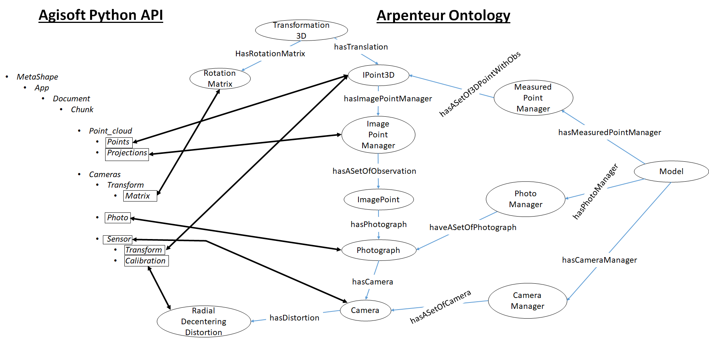

# ExportAgisoftOWL
Python script for automatic export of an Agisoft Metashape project to an OWL ABOX modeled with Arpenteur ontology

## Usage
This script is supposed to be used in Agisoft Photoscan Pro (tested with Version 1.4.4).
This script will automatically process all chunks.

Run the script in Tools > Run script

## Mapping Pattern

## License
http://creativecommons.org/licenses/by/4.0/

## Acknowlegement

[iMareCulture](https://imareculture.eu/)
